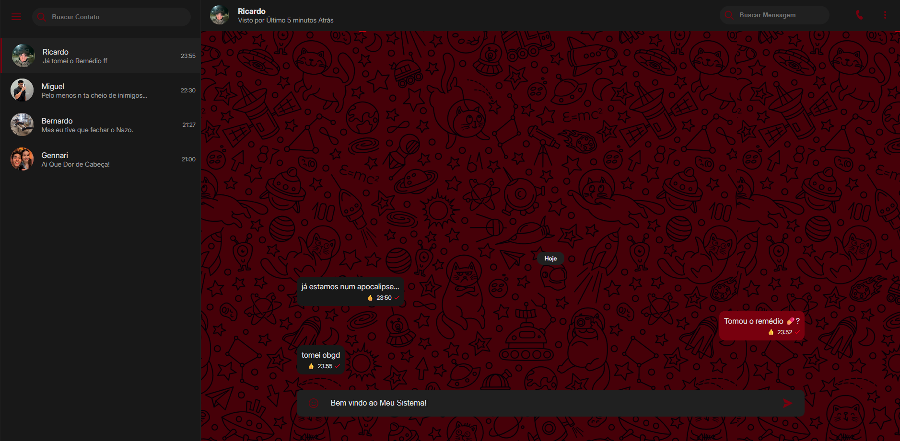

# WhatsMBP 💬

Um clone funcional e estilizado de uma interface de mensagens web (estilo WhatsApp/Telegram), desenvolvido com foco em manipulação avançada de DOM, UI/UX Design e JavaScript Vanilla.

## 📱 Visão Geral

O **WhatsMBP** é uma aplicação front-end construída para simular a experiência de um web chat moderno. O projeto apresenta carregamento dinâmico de conversas, transições de interface, um Dark Mode nativo e até mesmo um bot integrado para simular a recepção de mensagens em tempo real.



## ✨ Funcionalidades

* **Carregamento Dinâmico:** Contatos, informações de perfil e histórico de mensagens são injetados dinamicamente via JavaScript a partir de um banco de dados local (Mockup).
* **Dark Mode Customizado:** Paleta de cores escuras e vermelhas implementada com variáveis CSS (`:root`), garantindo conforto visual e harmonia com o background estampado.
* **Busca Inteligente:** * Filtro de contatos em tempo real na barra lateral.
  * Busca de palavras dentro da conversa atual, com sistema de *highlight* preservando a estrutura da bolha de mensagem.
* **Sistema de Reações:** Menu flutuante de emojis interativo que permite reagir a mensagens individuais de forma limpa e responsiva.
* **Bot de Respostas Automáticas:** Ao enviar uma mensagem, um `setTimeout` aciona respostas aleatórias baseadas na personalidade de cada contato.
* **Feedback Visual de UI:** Destaque em tempo real do contato ativo na barra lateral, com transições suaves e sombras aplicadas via CSS (`box-shadow`).

## 🛠️ Tecnologias Utilizadas

* **HTML5:** Semântica e estrutura de blocos.
* **CSS3:** * Layout construído inteiramente com **Flexbox** (UI Kit customizado).
  * Variáveis de escopo global para o Dark Mode.
  * Pseudo-classes (`:hover`, `:empty`) e Animações (`@keyframes fade-in`).
* **JavaScript (Vanilla):**
  * Delegação de Eventos (*Event Delegation*).
  * Manipulação profunda de DOM (`createElement`, `appendChild`, `innerHTML`).
  * Uso de Arrays, Objetos e métodos de filtro (`filter`, `forEach`, `includes`).
  * Expressões Regulares (RegEx) para o sistema de busca.

## 📂 Estrutura do Projeto

```text
📦 WhatsMBP
 ┣ 📂 src
 ┃ ┣ 📂 assets
 ┃ ┃ ┣ 📂 css
 ┃ ┃ ┃ ┣ 📜 style.css       # Estilos globais
 ┃ ┃ ┃ ┗ 📜 ui--kit.css     # Classes utilitárias (Flexbox, margins, etc)
 ┃ ┃ ┣ 📂 icons             # Ícones em SVG (.svg)
 ┃ ┃ ┗ 📂 images            # Avatares e Background (.png, .jpg)
 ┃ ┗ 📂 script
 ┃   ┗ 📜 script.js         # Lógica principal e base de dados
 ┗ 📜 index.html            # Estrutura base da aplicação
```

## 🚀 Como Executar

Por ser um projeto puramente Front-End estático, não há necessidade de instalar dependências complexas.

1. Faça o clone deste repositório:
   ```
   git clone [https://github.com/Pedro-HCruzz/WhatsMBP.git](https://github.com/Pedro-HCruzz/WhatsMBP.git)
   ```
2. Navegue até a pasta do projeto.

3. Abra o arquivo **index.html** diretamente no seu navegador de preferência.
    * Recomendação: Para uma melhor experiência de desenvolvimento, utilize a extensão **Live Server** do VS Code.

## 🧠 Próximos Passos (To-Do)
* Implementar localStorage para salvar as mensagens enviadas e reações, mantendo o estado ao recarregar a página.
* Trocar o banco de dados simulado por requisições HTTP reais (Fetch API) consumindo um backend.
* Adicionar funcionalidade de visualização de mídia (imagens e áudios falsos).

## 💻 Desenvolvido por Pedro.HCruzz - Projeto Prático Desenvolvido a Partir do Curso 'O Novo Programador'.